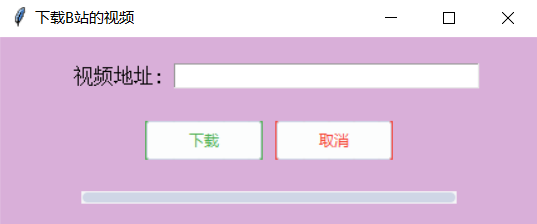
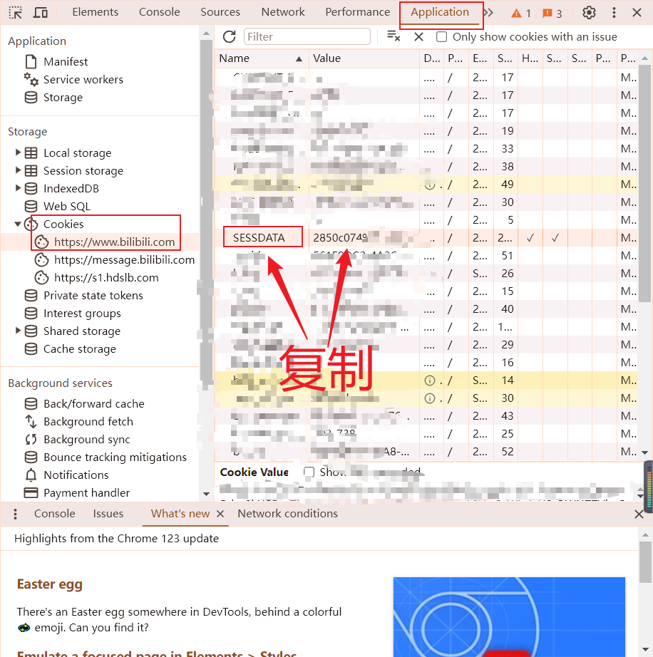

## 爬取biibii视频

#### 1.python环境

到python官网下载最新的即可:https://www.python.org/downloads/

#### 2.安装ffmpeg

官网地址：https://ffmpeg.org/

#### 3.安装依赖python依赖包

```shell
pip install requests beautifulsoup4 ttkthemes
```

#### 4. 爬取视频biibii视频

##### 4.1 运行文件

将以上三步的环境安装完毕即可运行这个downLoadBiiBiiVideo.py文件

> 目录命令行中

```shell
python downLoadBiiBiiVideo.py
```

复制要下载的链接到文本框，稍等片刻即可下载



注意：此时下载的视频是清晰的，要是想下载高清的视频需要拿到b站的登录cookie，放入请求头

##### 4.2 获取登录cookie




```python
headers = {
        'User-Agent': 'Mozilla/5.0 (Windows NT 10.0; Win64; x64) AppleWebKit/537.36 (KHTML, like Gecko) Chrome/122.0.0.0 Safari/537.36',
        "Referer": "https://www.bilibili.com/",
        "Cookie":"SESSDATA=复制的cookieValue"
    };
```

这样下载下来的视频都是高清的。